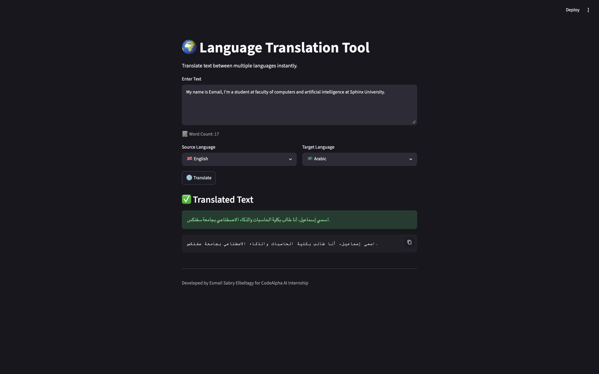

# 🌍 Language Translation Tool


# Language Translation Tool

## Preview



A simple language translation application developed using Python and Streamlit for the CodeAlpha Artificial Intelligence Internship.

## Features

- Translate text between multiple languages
- User-friendly interface
- Word counter
- Error handling
- Fast translation using Google Translate API

## Technologies Used

- Python
- Streamlit
- deep-translator

## Installation

```bash
pip install -r requirements.txt
```

## Run the Application

```bash
streamlit run app.py
```

## Project Structure

```text
CodeAlpha_LanguageTranslationTool
│
├── app.py
├── requirements.txt
├── README.md
```

## Author

Esmail Sabry Elbeltagy
